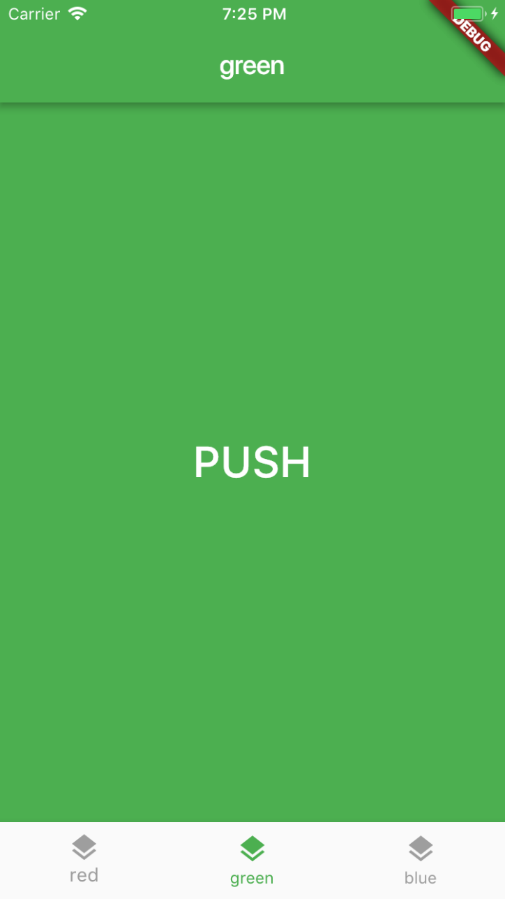
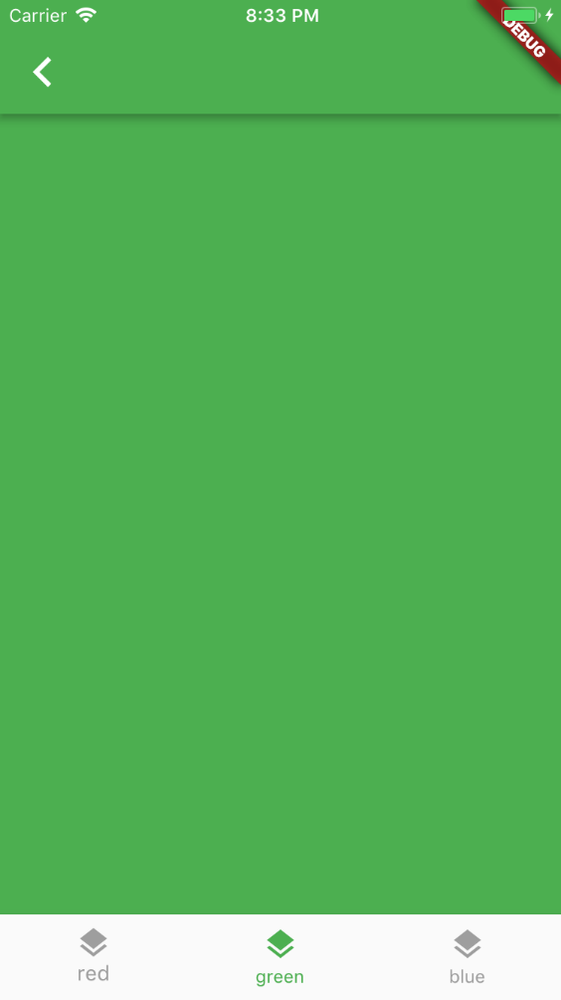

# Nested navigation with BottomNavigationBar

This sample app shows how to use separate navigators for each tab in a [BottomNavigationBar](https://docs.flutter.io/flutter/material/BottomNavigationBar-class.html).





**NOTE**: This project is Work In Progress and is open sourced to highlight a potential issue with [NavigatorfObserver](https://docs.flutter.io/flutter/widgets/NavigatorObserver-class.html).

## Problem statement

**Enable state restoration of multiple navigation stacks inside a `BottomNavigationBar`. This is a common use case for a lot of apps.**

## Details

* Pushing a new [MaterialPageRoute](https://docs.flutter.io/flutter/material/MaterialPageRoute-class.html) from within a `BottomNavigationBar` causes the whole screen to be pushed out with the new page.
* This is hardly desirable: most apps using a bottom navigation bar have a separate navigation stack for each tab (e.g. the YouTube app). The bottom navigation bar stays in place when performing push navigation within a tab.
* This can be done in Flutter by using a `MaterialApp` as the `body` of the `BottomNavigationBar`, and configuring it with a separate global `navigationKey` for each tab.
* This solves only half of the problem though, as a new navigation stack is created when switching tabs.
* Some state restoration logic alleviates this problem by keeping track of the desired `initialRoute` for each tab as routes are pushed and popped.
* In order to reliably track this, it should be possible to register a `NavigatorObserver` when creating the `MaterialApp`, and override the `didPush` / `didPop` methods to keep track of state.
* Unfortunately, registering a `NavigatorObserver` causes an exception when switching tabs:

```
flutter: ══╡ EXCEPTION CAUGHT BY WIDGETS LIBRARY ╞═══════════════════════════════════════════════════════════
flutter: The following assertion was thrown building DefaultTextStyle(debugLabel: fallback style; consider
flutter: putting your text in a Material, inherit: true, color: Color(0xd0ff0000), family: monospace, size:
flutter: 48.0, weight: 900, decoration: double Color(0xffffff00) TextDecoration.underline, softWrap: wrapping
flutter: at box width, overflow: clip):
flutter: 'package:flutter/src/widgets/navigator.dart': Failed assertion: line 1209 pos 14:
flutter: 'observer.navigator == null': is not true.
flutter:
flutter: Either the assertion indicates an error in the framework itself, or we should provide substantially
flutter: more information in this error message to help you determine and fix the underlying cause.
flutter: In either case, please report this assertion by filing a bug on GitHub:
flutter:   https://github.com/flutter/flutter/issues/new
```

Debugging this reveals that the `observer.navigator` is an instance of `HeroController`.

#### WidgetsApp

Further investigation reveals that with some tweaks it may be possible to use [WidgetsApp](https://docs.flutter.io/flutter/widgets/WidgetsApp-class.html) instead of `MaterialApp` (`WidgetsApp` doesn't have a `HeroController`), but it seems dubious that this is the way to go. In any case, when trying to push a route with `WidgetsApp` we encounter another exception:

```
flutter: ══╡ EXCEPTION CAUGHT BY WIDGETS LIBRARY ╞═══════════════════════════════════════════════════════════
flutter: The following NoSuchMethodError was thrown building BackButton(dirty):
flutter: The getter 'backButtonTooltip' was called on null.
flutter: Receiver: null
flutter: Tried calling: backButtonTooltip
flutter:
flutter: When the exception was thrown, this was the stack:
flutter: #0      Object.noSuchMethod (dart:core/runtime/libobject_patch.dart:46:5)
flutter: #1      BackButton.build (package:flutter/src/material/back_button.dart:87:50)
```

## Summary / Questions

* How to keep track of the navigation state of multiple Navigators within a `BottomNavigationBar`?
* Is there an alternative to `BottomNavigationBar`, which allows to use multiple navigation stacks and presere the state?


### [License: MIT](LICENSE.md)
