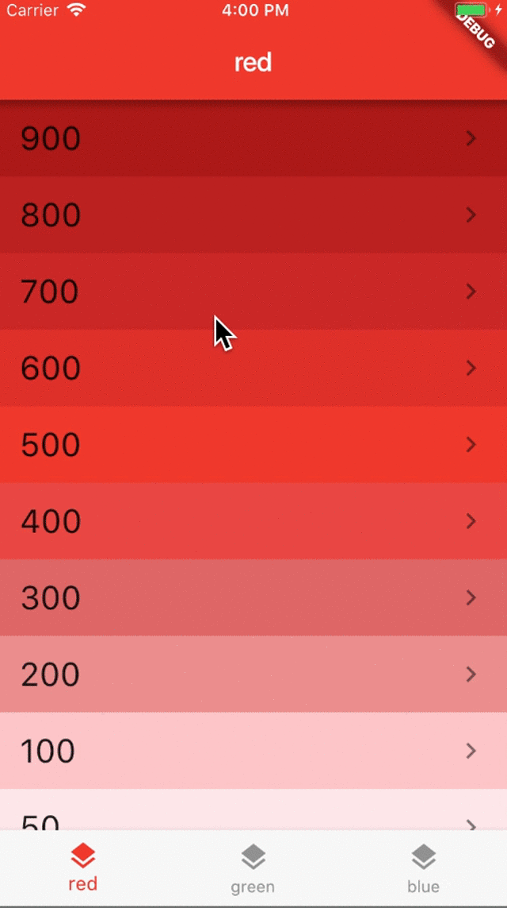

# Multiple Navigators with BottomNavigationBar

This is the source code for my article:

- [Flutter Case Study: Multiple Navigators with BottomNavigationBar](https://medium.com/coding-with-flutter/flutter-case-study-multiple-navigators-with-bottomnavigationbar-90eb6caa6dbf)

## Preview

In this example each tab has its own navigation stack. This is so that we don’t lose the navigation history when switching tabs.

This is a very common use case for a lot of apps.

**How is it built?**

- Create an app with a `Scaffold` and a `BottomNavigationBar`.
- In the `Scaffold` body, create a `Stack` with one child for each tab.
- Each child is an `Offstage` widget with a child `Navigator`.
- Don't forget to handle Android back navigation with `WillPopScope`.

Read the full story on my article:

- [Flutter Case Study: Multiple Navigators with BottomNavigationBar](https://medium.com/coding-with-flutter/flutter-case-study-multiple-navigators-with-bottomnavigationbar-90eb6caa6dbf)

### Credits

- [Brian Egan](https://github.com/brianegan): for suggesting to use `Stack` + `Offstage` & `Navigator` widgets.

### [License: MIT](LICENSE.md)
